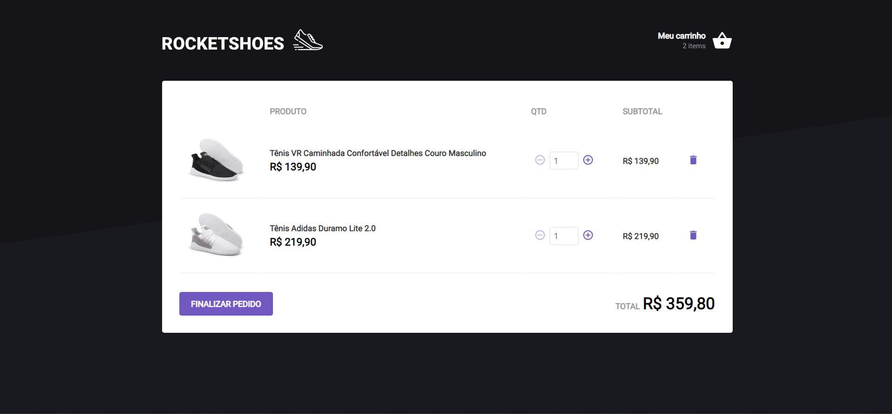
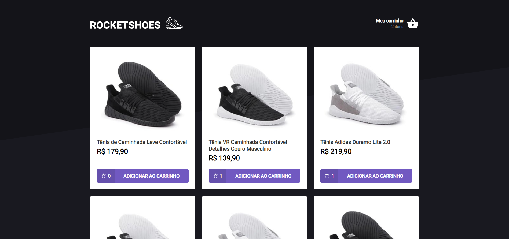

# Shopping Cart Challenge

## :zap: Sobre

Esta aplicação é um site de venda de tênis. Há um json com uma fake api para demonstrar o conteúdo utilizando requisições, como realmente seria feito em um ambiente de produção.

É um desafio feito no programa Ignite da [Rocketseat](https://rocketseat.com.br/). O principal objetivo era a criação de hook para controlar todas as funcionalidades básicas de um carrinho de compras guardando tudo na api localstorage. Para mais informações segue o clique no [link](https://www.notion.so/Desafio-01-Criando-um-hook-de-carrinho-de-compras-5769216778794019a83f544e79167b12#4db8e67c004747318b1397e04ba2682d).

## :gear: Dependências

- [Node.js](https://nodejs.org/en/)
- [ReactJS](https://reactjs.org/)

## :rocket: Como executar

<pre><code>
  # Instalar dependências
  $ yarn # ou npm install
  # Executar a fake api
  $ yarn server
  # Executar em desenvolvimento
  $ yarn start # ou npm run dev
</code></pre>

## :camera: Imagens

  
  

